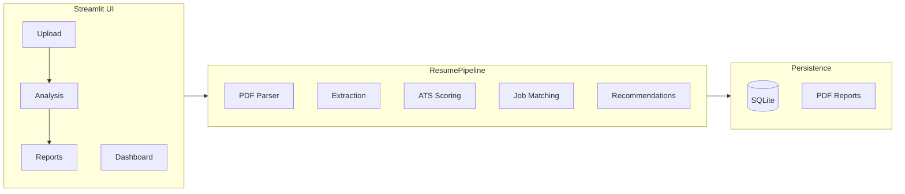

# AI-Powered Resume Analyzer & Job Matching System (ATS)

[](https://github.com/GmdDev074/AI-Resume_Checker_ATS)

**Final Year Project** — A local, modular platform that analyzes PDF resumes against job descriptions, scores ATS compatibility, measures semantic job fit, highlights skill gaps, and exports professional PDF reports. **No paid APIs** (no OpenAI/Gemini); everything runs on your machine.

---

## Table of contents

1. [Main purpose](#main-purpose)
2. [What we have achieved](#what-we-have-achieved)
3. [Technology stack](#technology-stack)
4. [Models used](#models-used)
5. [Project structure](#project-structure)
6. [Clone this repository](#clone-this-repository)
7. [Installation](#installation)
8. [How to run](#how-to-run)
9. [Usage workflow](#usage-workflow)
10. [Scoring methodology](#scoring-methodology)
11. [Evaluation & thesis docs](#evaluation--thesis-docs)
12. [Troubleshooting](#troubleshooting)
13. [Contributing & license](#contributing--license)

---

## Main purpose

Hiring teams and job seekers spend significant time manually comparing resumes to job descriptions. Applicant Tracking Systems (ATS) often reject candidates based on keyword gaps even when experience is relevant.

**This project automates that screening step** by:

| Goal | How the system addresses it |
|------|-----------------------------|
| Parse resumes reliably | PDF text extraction via **PyMuPDF** |
| Understand job requirements | Job description input + sample templates |
| Measure fit quantitatively | **ATS score** (rule-based) + **job match %** (skills + semantics) |
| Explain gaps | Matched vs missing skills, charts, recommendations |
| Support decisions with evidence | History in **SQLite**, downloadable **PDF reports** |
| Stay thesis-ready | Evaluation scripts (precision/recall/F1), baseline comparison, documentation |

The application is designed as a **clean, layered codebase** suitable for demonstration, extension, and academic evaluation—not as a black-box cloud API.

---

## What we have achieved

### Core product features

- **Streamlit dashboard** — Dashboard, Upload, Analysis, Reports (professional light UI)
- **PDF resume upload** — Single or multiple PDFs, size validation, corrupt-file handling
- **Job description matching** — Paste custom JD or select sample roles
- **Structured extraction** — Skills, education, experience, contact (regex + skill database + optional spaCy)
- **ATS compatibility score** — Weighted breakdown (skills, experience, education, completeness, formatting)
- **Semantic job match** — Sentence Transformer embeddings + scikit-learn cosine similarity
- **Skill gap analysis** — Matched/missing skills, pie chart, searchable skill database
- **Recommendations** — Actionable ATS and career suggestions
- **Multi-resume comparison** — Rank candidates by match score
- **PDF report export** — ReportLab-generated reports with scores and skills
- **SQLite persistence** — Analysis history and report metadata
- **Optional REST API** — FastAPI endpoint for programmatic analysis

### Research & thesis alignment

- **Keyword-only baseline matcher** for comparison with hybrid (embedding + skills) approach
- **Evaluation pipeline** — 55 labeled samples, metrics written to `latest_report.json`
- **Documentation** — Thesis alignment, ethical AI, database schema
- **Unit tests** — Parser, extraction, ATS, matching, evaluation (`pytest`)

### Engineering quality

- Modular **service-oriented** layout (UI → pipeline → services)
- Type hints and docstrings on public APIs
- Graceful **fallbacks** if spaCy or Sentence Transformers are unavailable (reduced accuracy)
- `.gitignore` excludes `venv/`, databases, generated PDFs, and caches

---

## Technology stack

| Layer | Technology | Role |
|-------|------------|------|
| **Language** | Python 3.12+ | Core runtime |
| **Web UI** | [Streamlit](https://streamlit.io/) | Interactive dashboard |
| **REST API** (optional) | [FastAPI](https://fastapi.tiangolo.com/) + Uvicorn | HTTP `/analyze` endpoint |
| **PDF input** | [PyMuPDF](https://pymupdf.readthedocs.io/) (`fitz`) | Extract text from resumes |
| **PDF output** | [ReportLab](https://www.reportlab.com/) | Generate analysis reports |
| **Embeddings** | [Sentence Transformers](https://www.sbert.net/) | Semantic similarity |
| **Similarity math** | [scikit-learn](https://scikit-learn.org/) | Cosine similarity on embeddings |
| **NLP (optional)** | [spaCy](https://spacy.io/) | Supplementary NLP (`en_core_web_sm`) |
| **Data** | JSON skill DB, SQLite, Pandas/NumPy | Storage and evaluation |
| **Charts** | Plotly, Matplotlib | Gauges, skill gap, ATS breakdown |
| **Testing** | pytest | Automated tests |

**Architectural pattern:** Presentation (`ui/`) → orchestration (`resume_pipeline.py`) → domain services (`services/`) → models (`models/`). The UI never calls low-level parsers directly.



---

## Models used

### Primary ML / NLP models

| Model | ID / name | Purpose | Size / notes |
|-------|-----------|---------|--------------|
| **Sentence Transformer** | `sentence-transformers/all-MiniLM-L6-v2` | Encodes resume + job description text into 384-d vectors for semantic match | ~90 MB download on **first run**; cached by Hugging Face |
| **spaCy pipeline** (optional) | `en_core_web_sm` | English NLP tokenization/entities when installed | Install: `python -m spacy download en_core_web_sm` |

Configured in `resume_analyzer/config/settings.py`:

```python
embedding_model = "sentence-transformers/all-MiniLM-L6-v2"
spacy_model = "en_core_web_sm"
```

### Supporting logic (not deep learning)

| Component | Method |
|-----------|--------|
| Skill detection | Curated `skills_database.json` + regex / pattern matching |
| ATS score | Weighted heuristic rules (`services/ats/`) |
| Keyword baseline | Exact skill overlap only (`services/matching/baseline_matcher.py`) |
| Fallback embeddings | Hash-based vectors if Sentence Transformers unavailable |

### What we do **not** use (proposal deviations)

- No Gemini / OpenAI / paid LLM APIs  
- No LSA, SVM, or full BERT fine-tuning pipeline (see [THESIS_ALIGNMENT.md](resume_analyzer/docs/THESIS_ALIGNMENT.md))

---

## Project structure

```
ResumeChecker/                          # Repository root (clone here)
├── .streamlit/
│   └── config.toml                     # Streamlit theme (light)
├── .gitignore                          # venv, *.db, reports, caches
├── pytest.ini                          # Test discovery
├── README.md                           # This file
│
└── resume_analyzer/                    # Application package
    ├── app.py                          # Streamlit entry point
    ├── requirements.txt                # Python dependencies
    ├── resume_analyzer.db              # SQLite (created at runtime, gitignored)
    ├── generated_reports/              # PDF exports (gitignored)
    │
    ├── api/
    │   └── main.py                     # Optional FastAPI server
    │
    ├── config/
    │   ├── settings.py                 # Paths, model names, limits
    │   └── constants.py                # ATS weights, thresholds
    │
    ├── data/
    │   ├── skills_database.json        # Searchable skill ontology
    │   ├── sample_job_descriptions.json
    │   ├── sample_resumes/             # Demo .txt resumes
    │   └── evaluation/                 # Labeled sets + benchmark output
    │
    ├── docs/
    │   ├── DATABASE_SCHEMA.md
    │   ├── THESIS_ALIGNMENT.md
    │   └── ETHICAL_AI.md
    │
    ├── models/                         # Dataclasses (Resume, Job, Scores)
    │
    ├── services/
    │   ├── pdf/                        # PDF parsing
    │   ├── extraction/                 # Skills, education, experience, contact
    │   ├── ats/                        # ATS scoring
    │   ├── matching/                   # Embeddings, similarity, baseline
    │   ├── recommendation/             # Suggestions
    │   ├── report/                     # PDF generation
    │   ├── evaluation/                 # Precision/recall/F1
    │   ├── storage/                    # SQLite
    │   └── resume_pipeline.py          # End-to-end orchestration
    │
    ├── scripts/
    │   ├── run_evaluation.py
    │   ├── generate_kaggle_evaluation_set.py
    │   └── import_kaggle_csv.py
    │
    ├── tests/                          # pytest suite
    │
    └── ui/
        ├── theme.py                    # Branding + CSS injection
        ├── styles.py                   # Global light theme CSS
        ├── pages/                      # Dashboard, Upload, Analysis, Reports
        └── components/                 # Charts, tables, score cards, layout
```

---

## Clone this repository

### HTTPS (recommended)

```bash
git clone https://github.com/GmdDev074/AI-Resume_Checker_ATS.git
cd AI-Resume_Checker_ATS
```

### SSH

```bash
git clone git@github.com:GmdDev074/AI-Resume_Checker_ATS.git
cd AI-Resume_Checker_ATS
```

### If the folder name differs locally

After clone, your working directory might be `ResumeChecker` or `AI-Resume_Checker_ATS`—use whichever path you have; all commands below assume you are at the **repository root** (where `resume_analyzer/` exists).

---

## Installation

### Prerequisites

| Requirement | Details |
|-------------|---------|
| **Python** | 3.12 or newer |
| **RAM** | 4 GB+ recommended (embedding model load) |
| **Disk** | ~500 MB for venv + model cache |
| **Git** | For cloning |
| **Internet** | First run downloads `all-MiniLM-L6-v2` |

### Step 1 — Virtual environment

**Windows (PowerShell):**

```powershell
cd "C:\path\to\AI-Resume_Checker_ATS"
python -m venv venv
.\venv\Scripts\Activate.ps1
```

**Linux / macOS:**

```bash
cd AI-Resume_Checker_ATS
python3 -m venv venv
source venv/bin/activate
```

### Step 2 — Install dependencies

```bash
pip install --upgrade pip
pip install -r resume_analyzer/requirements.txt
python -m spacy download en_core_web_sm
```

> **Note:** The app can run without spaCy or Sentence Transformers using fallbacks, but **full accuracy requires both**.

### Step 3 — Verify tests (optional)

```bash
pytest
```

First full test run may take **2–3 minutes** while the embedding model loads.

---

## How to run

### Streamlit web application (primary)

From the **repository root**:

```bash
streamlit run resume_analyzer/app.py
```

Browser opens at `http://localhost:8501` (default).

**Windows path with spaces:**

```powershell
cd "C:\Users\GrowMore Devs\Desktop\Projects\ResumeChecker"
.\venv\Scripts\Activate.ps1
python -m streamlit run resume_analyzer/app.py
```

### Optional FastAPI server

```bash
uvicorn resume_analyzer.api.main:app --reload --host 127.0.0.1 --port 8000
```

Example request:

```bash
curl -X POST "http://127.0.0.1:8000/analyze" ^
  -F "job_description=Python FastAPI Docker AWS" ^
  -F "file=@your_resume.pdf"
```

### Run evaluation benchmark

```bash
python resume_analyzer/scripts/run_evaluation.py
```

Output: `resume_analyzer/data/evaluation/latest_report.json`

---

## Usage workflow

1. **Upload Resume** — Upload one or more PDFs, or enable *Use sample resume* for demo text.
2. **Job description** — Choose a sample template or paste a full JD.
3. **Parse** — Click *Parse documents and continue*.
4. **Analysis** — Open **Analysis** → *Run analysis* for ATS score, match %, skill gap, baseline comparison.
5. **Reports** — Generate PDF; view past runs on **Dashboard** and **Reports**.

Sidebar pills show progress: resume loaded → job set → analysis complete.

---

## Scoring methodology

### ATS score (0–100)

| Factor | Weight |
|--------|--------|
| Skills match | 40 |
| Experience | 25 |
| Education | 15 |
| Resume completeness | 10 |
| Formatting | 10 |

### Job match score

**Hybrid match** = **60%** skill overlap + **40%** semantic cosine similarity (MiniLM embeddings via scikit-learn).

**Keyword baseline** = exact skill overlap only (shown on Analysis for thesis comparison).

---

## Evaluation & thesis docs

| Document | Path |
|----------|------|
| Proposal vs implementation | [resume_analyzer/docs/THESIS_ALIGNMENT.md](resume_analyzer/docs/THESIS_ALIGNMENT.md) |
| Ethical AI | [resume_analyzer/docs/ETHICAL_AI.md](resume_analyzer/docs/ETHICAL_AI.md) |
| Database schema | [resume_analyzer/docs/DATABASE_SCHEMA.md](resume_analyzer/docs/DATABASE_SCHEMA.md) |
| Evaluation datasets | [resume_analyzer/data/evaluation/README.md](resume_analyzer/data/evaluation/README.md) |

| Dataset | File | Samples |
|---------|------|---------|
| Kaggle-style labels | `kaggle_labeled_resumes.json` | 50 |
| Full evaluation set | `all_labeled_resumes.json` | 55 (default) |

Regenerate labels:

```bash
python resume_analyzer/scripts/generate_kaggle_evaluation_set.py
```

---

## Troubleshooting

### Git: `src refspec main does not match any`

**Cause:** No commits on `main` yet.  
**Fix:**

```bash
git add .
git commit -m "Initial commit"
git push -u origin main
```

### `streamlit` not found

Activate the venv, then install requirements or use:

```bash
python -m streamlit run resume_analyzer/app.py
```

### PowerShell: `&&` is not valid

Use `;` instead, or run commands on separate lines:

```powershell
cd "C:\path\to\repo"; .\venv\Scripts\Activate.ps1; python -m streamlit run resume_analyzer/app.py
```

### First analysis is very slow

The **Sentence Transformer** model downloads and loads once (~90 MB). Later runs are faster. Ensure stable internet on first launch.

### spaCy model missing

```bash
python -m spacy download en_core_web_sm
```

### UI changes not visible after code edits

**Restart Streamlit** (stop the terminal process with `Ctrl+C`, then run again). Use browser refresh; for CSS-only changes, try `Ctrl+F5`.

### PDF upload fails

- File must be **PDF**, under **10 MB** (see `max_upload_mb` in settings).
- Scanned/image-only PDFs may extract little text—use text-based PDFs when possible.

### Low match scores

- Ensure the job description includes **skills and requirements** (not only a title).
- Check **Analysis** tab for *Keyword baseline* vs *Hybrid match* to see if semantics help.

### Database or reports not found

- DB path: `resume_analyzer/resume_analyzer.db` (created on first save).
- Reports: `resume_analyzer/generated_reports/` (gitignored; created on export).

### Push to GitHub rejected (authentication)

Sign in via GitHub CLI (`gh auth login`), SSH keys, or Personal Access Token when prompted by Git.

---

## Extending the project

| Task | Where to edit |
|------|----------------|
| Add skills | `resume_analyzer/data/skills_database.json` |
| Change ATS weights | `resume_analyzer/config/constants.py` |
| Change embedding model | `resume_analyzer/config/settings.py` |
| New extraction rule | `resume_analyzer/services/extraction/` |
| New UI page | `resume_analyzer/ui/pages/` |
| New chart | `resume_analyzer/ui/components/charts.py` |

---

## Contributing & license

Educational / Final Year Project use. Fork the repo, open issues, or submit pull requests on GitHub.

**Author / maintainer:** [GmdDev074](https://github.com/GmdDev074)  
**Repository:** https://github.com/GmdDev074/AI-Resume_Checker_ATS

---

## Quick reference

```bash
# Clone
git clone https://github.com/GmdDev074/AI-Resume_Checker_ATS.git
cd AI-Resume_Checker_ATS

# Setup
python -m venv venv
source venv/bin/activate          # Windows: .\venv\Scripts\Activate.ps1
pip install -r resume_analyzer/requirements.txt
python -m spacy download en_core_web_sm

# Run
streamlit run resume_analyzer/app.py

# Test
pytest
```

For module-level notes, see [resume_analyzer/README.md](resume_analyzer/README.md).
